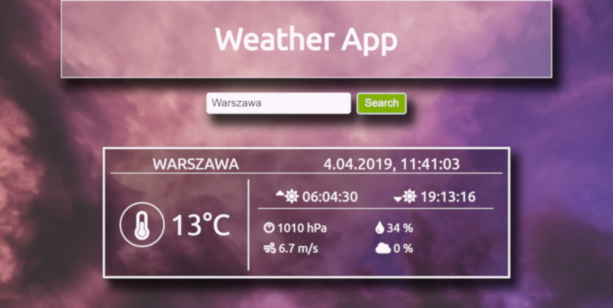
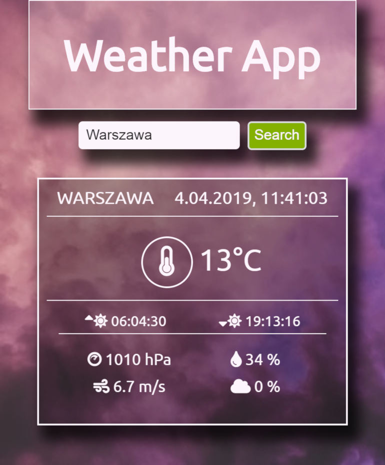
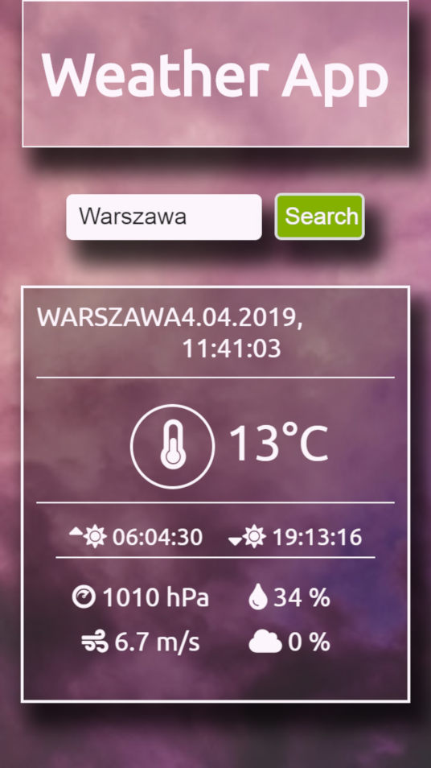

This project was bootstrapped with [Create React App](https://github.com/facebook/create-react-app).

# WEATHER APP REACT
> Hi everyone! This is my version of simple WEATHER APP. 

## Technologies:
* React
* Java Script
* HTML5
* CSS 3

## General info
I made this app to learn basic skills in React. 
This is simple Weather App. You can find city and check weather there. 
I used Weather API from https://openweathermap.org/api.

## Screenshots

## Contact
Created by [lubiankamateusz@gmail.com] - feel free to contact me!
